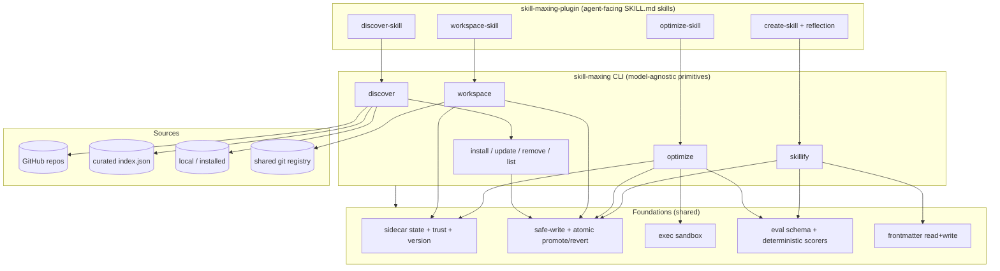
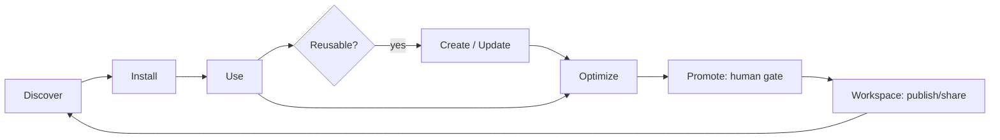
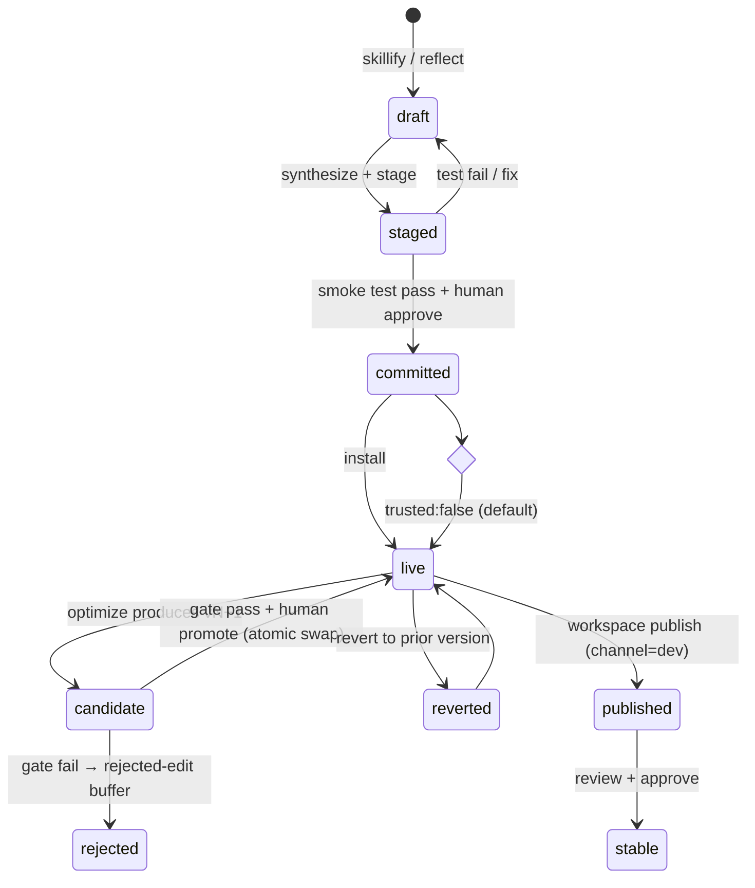

# feat: Skill Maxing superpower plugin — discover, create, optimize, and share skills

## Summary

Build a "superpower" plugin that gives any agent three automated loops over AI skills — **discover** (from public GitHub repos + a curated index + local), **create** (from a description or in-session reflection), and **optimize** (an eval-gated SkillOpt-style loop with a human promotion gate) — plus a **Phase 2 workspace** for sharing skills internally and collaboratively optimizing them. Each capability ships as an agent-facing skill (`SKILL.md` + scripts) backed by new, model-agnostic TypeScript CLI primitives. The existing Phase 1 installer (`src/`) is a built dependency, reused rather than re-planned.

---

## Problem Frame

`skill-maxing` today is a cross-agent skill *installer* (`init`, `install`, `list`, `update`, `remove`, `doctor`) with solid foundations: source parsing/resolution via depth-1 git clone, two lock files, a parse-only frontmatter reader, hardened path/name sanitization, and five agent adapters. What it cannot yet do is the thing that makes skills *abundant and self-improving*: find good skills from the public ecosystem, manufacture new ones from work the agent already did, and make existing ones measurably better over time — then let a team pool that effort.

The request is to deliver that core loop as an **agent-native** capability ("superpower plugin"): the agent loads skills that orchestrate discover/create/optimize, calling thin CLI primitives for the deterministic, side-effecting work. The CLI never makes LLM calls itself; the host agent supplies any reasoning. Phase 2 extends the same primitives to a git-based team workspace.

The research pass (see Sources & Research) surfaced that the existing data model has **no slot** for the concepts this plan depends on — provenance, trust, skill version, eval score, or lifecycle state — and that several existing behaviors (silent name-collision overwrite, parse-only frontmatter, symlink installs, non-atomic writes, no code-execution isolation, merge-hostile global lock) are footguns once create/optimize/workspace exist. The plan therefore front-loads a **Foundations** milestone before any of the four user-facing surfaces.

---

## Requirements

### Foundations (shared primitives)

- R1. All per-skill state (provenance/origin, trust, semantic version, lifecycle, eval score) is recorded **outside** the content-hashed skill directory, so reproducible-install hashes (`computeSkillHash`) do not churn.
- R2. Agent-created and publicly-discovered skills default to `trusted: false`; trust is granted only by an explicit user action.
- R3. Writing `SKILL.md` uses a YAML-only serializer that never emits executable frontmatter, preserving the deliberate RCE mitigation (no `gray-matter` / no `---js`).
- R4. Every write boundary (install, create-commit, optimize-promote, workspace-sync) validates the skill name via `validateName` and refuses silent overwrite; `name` == directory name == lock key is enforced.
- R5. Promotion and revert are atomic and reversible; the prior live version is always recoverable.
- R6. Skill-authored scripts and eval rollouts execute only in a constrained, trust-gated sandbox (no shell, no network where enforceable, timeout, cwd jail); `trusted: false` skills never auto-execute.
- R7. There is exactly one eval format (task set + scoring contract) shared by create scaffolds and optimize; scoring is deterministic (LLM used for reflection only, never to judge pass/fail).

### Discovery

- R8. Discovery finds skills from a curated in-repo index, public GitHub repos following the `SKILL.md` convention, and local/installed skills.
- R9. Results are deduped across sources and ranked by relevance to the user's intent — lexical + metadata by default, with an optional embeddings path that falls back deterministically when no provider is configured.
- R10. A discovered candidate is installable without re-resolving the source (the resolved commit is pinned and passed to the existing install path).
- R11. Discovery is exposed as an agent-facing skill that runs the discover → select → install loop.

### Creation

- R12. A complete skill (frontmatter, body, deterministic scripts, resolver triggers, eval scaffold) can be synthesized from a description **or** from in-session reflection on completed work.
- R13. Creation follows an atomic stage → test → approve → commit pipeline with a human approval gate; drafts persist and resume across sessions.
- R14. Before creating, the system searches existing skills and prefers updating an existing one (prefer-update-over-create) to prevent proliferation.
- R15. Creation is exposed as an agent-facing skill, including an always-on post-task reflection nudge that proposes crystallizing reusable workflows.

### Optimization

- R16. Optimization runs an eval-gated loop (rollout → reflect → aggregate → select → update → validate) with an edit budget, a rejected-edit buffer, and a protected slow-update region.
- R17. A candidate becomes the live version only after passing the gate (score strictly improves, no held-out regression) **and** human approval; every version is score-linked and reversible.
- R18. Optimization operates on a managed working copy, never editing a symlinked source in place.
- R19. Optimization is exposed as an agent-facing skill; the host agent supplies the reflect/edit model calls while the CLI stays model-agnostic.

### Workspace (Phase 2)

- R20. Lock files are merge-friendly (sorted keys, conflict-prone fields normalized/removed) before any team use.
- R21. A skill can be published to and synced from a git-based shared workspace registry with channels (`dev`/`beta`/`stable`); synced skills are namespaced by origin so a sync never clobbers a local skill.
- R22. Teams can pool eval results/feedback and collaboratively optimize; promotion to `stable` requires review/approval; lock and content merge conflicts are detected and surfaced rather than silently resolved.
- R23. Workspace operations are exposed as an agent-facing skill.

### Packaging

- R24. The four capabilities ship as an installable agent plugin (`skill-maxing-plugin/`) of `SKILL.md` skills + scripts backed by the CLI primitives, with a manifest and documentation.

---

## Key Technical Decisions

- KTD1. **Sidecar state store, not frontmatter or lock files.** Per-skill state lives in `~/.skillmax/state/<name>.json` (global) with project mirrors as needed, never inside the installed skill dir. Rationale: keeps `SKILL.md` content clean, avoids churning `computeSkillHash` (which would falsely mark every optimized skill "modified"), and matches the Hermes `.usage.json` sidecar pattern. (Resolves flow-analysis C1, I8.)
- KTD2. **`trusted: false` by default, execution gated on trust.** Discovered and agent-created skills are untrusted until a user grants trust; the sandbox refuses to auto-execute untrusted skills. (Resolves C3 policy half.)
- KTD3. **YAML-only frontmatter serializer.** Add a writer built on the existing `yaml` dependency's `stringify`; never reintroduce `gray-matter` or executable frontmatter. The repo deliberately chose `yaml` over `gray-matter` to avoid eval-based RCE — the writer must not undo that.
- KTD4. **Atomic promote/revert via sibling-dir + rename, with retained versions.** Candidates are written to a sibling directory and swapped in by atomic rename; the previous live version is retained under `~/.skillmax/versions/<name>/<version>/`. Replaces the current delete-then-write `symlinkOrCopy` for managed skills. (Resolves C4.)
- KTD5. **Optimize operates on a managed copy (copy-mode), never the symlink target.** Editing a symlinked skill in place would mutate the upstream source repo. Optimization checks out / copies into a managed working dir under `~/.skillmax`. (Resolves M4.)
- KTD6. **Execution isolation = constrained subprocess, not a container.** Reuse the `src/util/git.ts` hardening pattern (`execFile`, no shell, `GIT_TERMINAL_PROMPT=0`-style env scrub, timeout, validated cwd). No new runtime dependency; honest about its limits (it is defense-in-depth, not a security boundary against determined attackers — surfaced in Risks).
- KTD7. **Deterministic scoring only.** Scorers: exact/normalized match, sandboxed code-exec output comparison, and task-success signal. The host agent's LLM reflects on *why* a rollout failed; it never decides *whether* it passed. (SkillOpt principle.)
- KTD8. **CLI is model-agnostic; the host agent drives all LLM calls.** No API key is baked into the CLI. Reflection, edit proposal, and synthesis prompts are issued by the agent via the skill; the CLI provides the deterministic scaffolding (eval running, scoring, diff application, snapshotting). (Matches the chosen optimization posture.)
- KTD9. **Two-layer delivery: CLI primitives + thin agent-skill orchestration.** The "plugin" is a bundle of `SKILL.md` skills that call CLI subcommands. The CLI owns deterministic/side-effecting work; the skills own orchestration and reasoning. (Matches the chosen plugin shape.)
- KTD10. **GitHub discovery = clone-and-scan baseline + optional API path; curated `index.json` is the reliable seed.** Reuse `parseSource`/`resolveSource` (depth-1 clone, one-level scan) as the always-works baseline. When a `GITHUB_TOKEN` is present, an optional GitHub Trees/Search API path avoids full clones. The shipped curated `index.json` is the dependency-free baseline source. Rationale: public-API access is not guaranteed (external web research was unavailable this pass), and clone-scan already works.
- KTD11. **Git-based workspace registry, no server.** The shared registry is a git repo; publish/sync reuse `parseSource`/`resolveSource` and the lock machinery. Channels are modeled as a `channel` field plus (optionally) branches. Avoids standing up backend infrastructure for Phase 2.
- KTD12. **prefer-update-over-create matcher.** A proposed skill that exact-matches an existing name, or whose description similarity exceeds a threshold, routes to update/optimize instead of creating a sibling. Implements the Hermes UPDATE > ADD > CREATE hierarchy. (Resolves I4.)
- KTD13. **Test harness = `node:test` + `tsx`, zero new runtime deps.** Establishes the missing test infrastructure using Node's built-in runner, consistent with the repo's zero-dependency philosophy. Adds a `test` script.
- KTD14. **Adopt SkillOpt drift controls verbatim.** Edit budget as learning rate (default 4, cosine annealing), per-epoch rejected-edit buffer, protected `<!-- SLOW_UPDATE_START/END -->` region untouchable by step edits, and content-addressable candidate caching keyed on skill hash.

---

## High-Level Technical Design

### Component architecture



### The core loop (what the plugin enables end to end)



### Optimization loop (eval-gated, human-promoted)

```mermaid
sequenceDiagram
  participant Agent as Host agent (LLM)
  participant CLI as optimize CLI
  participant Box as Sandbox
  participant User
  CLI->>Box: rollout live skill on eval task set
  Box-->>CLI: trajectories + deterministic scores
  CLI->>Agent: reflect on failures (why)
  Agent-->>CLI: candidate edits (bounded by budget)
  CLI->>CLI: aggregate, select (drop rejected-edit-buffer dupes)
  CLI->>CLI: apply edits to managed copy → candidate snapshot
  CLI->>Box: validate candidate on held-out set
  Box-->>CLI: candidate score
  alt score improves & no regression
    CLI->>User: present candidate + score delta for approval
    User-->>CLI: approve
    CLI->>CLI: atomic promote (retain prior version)
  else fails gate
    CLI->>CLI: record in rejected-edit buffer, keep live version
  end
```

### Skill lifecycle state machine



---

## Output Structure

New and modified files (repo-relative). The per-unit **Files** lists remain authoritative; this tree shows overall shape.

```text
skill-maxing/
  src/
    types.ts                      # extend: SkillState, lifecycle, Eval, OptimizationRun, Channel
    state/
      store.ts                    # sidecar state read/write (U2)
      trust.ts                    # trust grant/check (U2)
    util/
      frontmatter.ts              # add serializer (U2)
      exec.ts                     # sandboxed subprocess runner (U4)
      versions.ts                 # atomic promote/revert + retained versions (U3)
      collision.ts                # name collision + validateName gate (U3)
    eval/
      schema.ts                   # eval task set + scoring contract (U5)
      scorers.ts                  # deterministic scorers (U5)
      runner.ts                   # run eval set in sandbox (U5)
    discover/
      index.ts                    # curated index.json loader (U6)
      github.ts                   # GitHub discovery (clone-scan + optional API) (U6)
      rank.ts                     # lexical+metadata ranking, embeddings hook (U7)
    create/
      skillify.ts                 # synthesis + atomic pipeline + draft store (U9)
      match.ts                    # prefer-update-over-create matcher (U9)
      reflect.ts                  # in-session reflection signal helpers (U10)
    optimize/
      loop.ts                     # rollout/reflect/aggregate/select/update/validate (U11)
      budget.ts                   # edit budget scheduler (U11)
      buffer.ts                   # rejected-edit buffer (U11)
      diff.ts                     # structured edit ops + slow-update region guard (U11)
    workspace/
      registry.ts                 # publish/sync/list against git registry (U14)
      channels.ts                 # channel model (U13)
      collab.ts                   # pooled evals + review/promote + conflict detect (U15)
    lock/
      global.ts                   # merge-readiness normalization (U13)
    commands/
      discover.ts                 # CLI (U7)
      skillify.ts                 # CLI (U9)
      optimize.ts                 # CLI (U11)
      workspace.ts                # CLI (U14)
    cli.ts                        # wire new subcommands (U7, U9, U11, U14)
  index/
    index.json                    # shipped curated skill index (U6)
  test/                           # node:test specs + fixtures (U1 + per-unit)
  skill-maxing-plugin/            # the agent-facing plugin (U8, U10, U12, U16, U17)
    plugin.json                   # manifest (U17)
    skills/
      discover-skill/SKILL.md     # (U8)
      create-skill/SKILL.md       # (U10)
      optimize-skill/SKILL.md     # (U12)
      workspace-skill/SKILL.md    # (U16)
    scripts/                      # thin wrappers shelling to the CLI
  package.json                    # add "test" script (U1)
```

---

## Implementation Units

Units are grouped into milestones and dependency-ordered. Foundations (M0) must land before the user-facing surfaces.

### Milestone 0 — Foundations

### U1. Test harness and fixtures

- Goal: Establish the missing test infrastructure so every feature-bearing unit below has somewhere to put scenarios.
- Requirements: enables verification of R1–R24.
- Dependencies: none.
- Files: `package.json` (add `"test": "tsx --test test/**/*.test.ts"` or `node --test` via tsx loader), `test/helpers/fixtures.ts`, `test/helpers/tmp.ts`, `test/README.md`.
- Approach: Use Node's built-in `node:test` + `node:assert/strict`, run through `tsx` so specs import `.ts` directly (no compile step in dev). Add a fixtures helper that materializes throwaway skill dirs in an OS temp dir (mirroring `makeTempDir`) and a teardown helper. No new runtime deps.
- Patterns to follow: `src/util/git.ts` temp-dir guards; existing ESM `.js` import convention in specs.
- Test scenarios:
  - Happy path: a trivial spec runs green via `npm test`.
  - Fixture helper creates and tears down a temp skill dir; asserts it is gone after teardown.
  - `Covers` n/a.
- Verification: `npm test` exits 0 and runs at least one real assertion; CI-ready command documented.

### U2. State, provenance, trust model, and frontmatter serializer

- Goal: Add the data model the rest of the plan depends on, and the ability to *write* `SKILL.md` safely.
- Requirements: R1, R2, R3.
- Dependencies: U1.
- Files: `src/types.ts` (add `SkillState`, `Lifecycle` enum, `Provenance`/`origin`, `trusted`, `version`, `score` fields; extend `SkillMeta` only with `version?`/`mutating?`-style minimal fields — keep richer state in the sidecar), `src/state/store.ts`, `src/state/trust.ts`, `src/util/frontmatter.ts` (add `serializeFrontmatter`/`writeSkillFile`), `test/state/store.test.ts`, `test/util/frontmatter-serialize.test.ts`.
- Approach: Sidecar JSON at `~/.skillmax/state/<name>.json` keyed by skill name, with atomic tmp+rename writes (mirror lock writers). State carries `origin` (`discovered`|`created`|`optimized`|`installed`), `trusted` (default `false`), `version`, `lifecycle`, and `scoreHistory[]`. Serializer round-trips frontmatter via `yaml.stringify`, strips terminal escapes on write, and refuses to emit any non-data frontmatter.
- Technical design (directional): state shape sketch — `{ name, origin, trusted, version, lifecycle, scoreHistory: [{version, score, at}], source? }`. Not a final schema.
- Patterns to follow: `src/lock/global.ts` atomic write + tolerant read; `src/util/frontmatter.ts` parse + `stripTerminalEscapes`.
- Test scenarios:
  - Happy path: write then read state round-trips all fields.
  - Default: newly recorded skill has `trusted: false`.
  - Edge: reading a missing/corrupt sidecar returns a safe default, never throws.
  - Serializer: a skill with `name`/`description`/`tools`/`triggers` round-trips parse→serialize→parse byte-stably for the frontmatter block.
  - Security: serializer refuses (or strips) any attempt to write executable/`---js`-style content; terminal escapes in `description` are stripped on write.
  - `Covers` n/a.
- Verification: state sidecar lives outside any skill dir; running `computeSkillHash` on a skill before/after a state write yields the same hash.

### U3. Safe-write, collision gate, and atomic version/promote/revert

- Goal: Make every write boundary collision-safe and make promotion/revert atomic and reversible.
- Requirements: R4, R5.
- Dependencies: U2.
- Files: `src/util/collision.ts`, `src/util/versions.ts`, `src/util/fs.ts` (add a guarded write path; keep existing `symlinkOrCopy` for trusted installs), `src/commands/install.ts` (route through the collision gate), `test/util/collision.test.ts`, `test/util/versions.test.ts`.
- Approach: Collision gate enforces `validateName`, case-insensitive name uniqueness, and `name == dir == lockKey`; on collision it refuses unless `--force`, and for workspace it namespaces by origin. Versioning writes candidates to a sibling dir, swaps via atomic `rename`, and retains the prior version under `~/.skillmax/versions/<name>/<version>/`. Revert restores a retained version by the same atomic swap.
- Patterns to follow: `src/util/sanitize.ts` (`validateName`, `isPathSafe`); `src/util/fs.ts` existing copy/symlink helpers.
- Test scenarios:
  - Happy path: promote vN→vN+1 makes vN+1 live; the live `SKILL.md` content equals the candidate.
  - Reversibility: revert after promote restores vN byte-for-byte.
  - Crash-safety: simulate failure mid-swap (e.g., candidate dir present, rename not yet done) → previous live version remains intact and resolvable.
  - Collision refuse: installing/creating a name that already exists fails with a clear error unless `--force`.
  - Collision namespacing: a workspace sync of a colliding name does not overwrite the local skill.
  - Name validation: an invalid frontmatter name (uppercase, leading hyphen) is rejected at the write boundary.
  - `Covers` AE2.
- Verification: no write path silently deletes an existing skill; retained-versions dir contains the prior version after every promote.

### U4. Execution sandbox primitive

- Goal: Run skill-authored scripts and eval rollouts under constraint, gated on trust.
- Requirements: R6.
- Dependencies: U2.
- Files: `src/util/exec.ts`, `test/util/exec.test.ts`.
- Approach: A `runSandboxed(cmd, args, opts)` wrapper over `execFile` (no shell), with a hard timeout, scrubbed env (no inherited secrets, network-disabling env where the platform supports it), a validated working directory jail, and output capture/size caps. Refuses to run a skill whose state is `trusted: false` unless `--allow-exec` is explicitly passed. Honest scope: process-level hardening, not a security container (see Risks).
- Execution note: build this before U5/U9/U11 wire any execution; nothing should execute skill code until this exists.
- Patterns to follow: `src/util/git.ts` `execFile` hardening (env, timeout, `GIT_TERMINAL_PROMPT=0`).
- Test scenarios:
  - Happy path: a trusted skill's script runs and returns captured stdout within the timeout.
  - Trust gate: a `trusted: false` skill is refused without `--allow-exec`.
  - Timeout: a script exceeding the timeout is killed and reported as failure, not a hang.
  - Jail: a script attempting to write outside its working dir is contained or fails the path check.
  - Output cap: oversized output is truncated, not buffered unbounded.
  - `Covers` AE1.
- Verification: no skill code path in the repo executes outside `runSandboxed`.

### U5. Eval schema and deterministic scorers

- Goal: Define the single eval format shared by create and optimize, plus the deterministic scorers and a runner.
- Requirements: R7.
- Dependencies: U4.
- Files: `src/eval/schema.ts`, `src/eval/scorers.ts`, `src/eval/runner.ts`, `test/eval/schema.test.ts`, `test/eval/scorers.test.ts`, `test/eval/runner.test.ts`.
- Approach: Eval set = a manifest of tasks, each with input, expected outcome, and a scorer reference. Scorers: `exact`/`normalized-match`, `code-exec` (runs via U4 sandbox, compares output), and `success-signal`. The runner executes a skill against a task set in the sandbox and returns per-task and aggregate scores. Deterministic and reproducible; no LLM in the scoring path.
- Technical design (directional): eval manifest sketch — `{ skill, tasks: [{ id, input, expect, scorer }], heldOut: [...] }`. Directional, not final.
- Patterns to follow: `src/util/frontmatter.ts` YAML parsing; U4 sandbox for `code-exec`.
- Test scenarios:
  - Happy path: an eval set with two exact-match tasks scores 2/2 for a correct skill, 1/2 for a partially-correct one.
  - Determinism: running the same eval set twice yields identical scores.
  - code-exec scorer: a task comparing program output passes/fails correctly via the sandbox.
  - Edge: malformed eval manifest fails with a clear error (hard-fail, not skip).
  - Edge: empty task set is rejected (optimize cannot run without tasks).
  - `Covers` AE3.
- Verification: the same schema file validates both a create-generated scaffold and an optimize input.

---

### Milestone 1 — Discover

### U6. Discovery sources: curated index, GitHub, local

- Goal: Gather candidate skills from all three sources with per-source isolation.
- Requirements: R8.
- Dependencies: U2.
- Files: `src/discover/index.ts`, `src/discover/github.ts`, `index/index.json` (seed), `test/discover/index.test.ts`, `test/discover/github.test.ts`.
- Approach: Curated `index/index.json` is the dependency-free baseline (hand-vetted entries: name, description, source, tags). GitHub discovery reuses `parseSource`/`resolveSource` clone-and-scan as the baseline, with an optional Trees/Search API path when `GITHUB_TOKEN` is set. Local source reuses the `list` scan over agent dirs. Each source is isolated: a failure or rate-limit in one (a bad repo, a 429) yields partial results plus a warning, never a total abort.
- Patterns to follow: `src/source/resolver.ts` (`resolveSource`, clone-scan, one-level descent); `src/commands/list.ts` (installed-skill scan); `src/util/git.ts` hardening.
- Test scenarios:
  - Happy path: index source returns parsed entries; local source returns installed skills.
  - GitHub: a repo with one `SKILL.md` and a repo with several both resolve (one-level scan).
  - Edge: a source that throws (bad repo / network) yields partial results + warning, not an abort.
  - Edge: malformed `SKILL.md` in a multi-skill repo is skipped-and-warned (discover semantics), not fatal.
  - Edge: missing/empty `index.json` degrades to other sources gracefully.
  - `Covers` AE4 (empty results contributes to it).
- Verification: discovery from a fixture index + a fixture local repo returns a merged candidate set; one failing source does not zero the results.

### U7. Ranking and the `discover` CLI command

- Goal: Rank/dedupe candidates and expose `skill-maxing discover`, handing a pinned candidate to install.
- Requirements: R9, R10.
- Dependencies: U6, U3.
- Files: `src/discover/rank.ts`, `src/commands/discover.ts`, `src/cli.ts` (wire `discover`/`search` case + `printHelp`), `test/discover/rank.test.ts`, `test/commands/discover.test.ts`.
- Approach: Lexical + metadata ranker (token overlap of intent vs. name/description/tags, with recency as a weak tiebreak; stars are a weak signal only). Optional embeddings hook behind an interface that falls back to lexical when no provider is configured — ranking stays deterministic. Dedupe across sources by normalized name, keeping the highest-ranked and recording the alternates. Selecting a candidate passes its resolved `commitSha` to `install()` so the installed artifact equals the ranked one (no re-resolve drift).
- Patterns to follow: `src/cli.ts` switch-case + `parseFlags` + `printHelp`; `src/commands/install.ts` invocation; `src/lock/global.ts` for pinned-source provenance.
- Test scenarios:
  - Happy path: intent "code review" ranks a `code-review` skill above an unrelated one.
  - Dedupe: two same-named skills from different sources collapse to one ranked entry with alternates recorded.
  - Determinism: identical inputs produce identical ordering.
  - Embeddings-off fallback: with no provider configured, ranking silently uses lexical and still returns ordered results.
  - Empty results: zero matches yields a clear message and a non-zero exit (no silent no-op).
  - Handoff: selecting candidate #2 installs exactly that pinned source/commit.
  - `Covers` AE4.
- Verification: `skill-maxing discover "<intent>"` prints a ranked list; selecting one installs the pinned source via the existing install path.

### U8. `discover-skill` agent skill

- Goal: Package discovery as an agent-facing skill that runs discover → select → install.
- Requirements: R11.
- Dependencies: U7.
- Files: `skill-maxing-plugin/skills/discover-skill/SKILL.md`, `skill-maxing-plugin/scripts/discover.(sh|ts)` (thin CLI wrapper).
- Approach: `SKILL.md` instructs the agent to elicit intent, call `skill-maxing discover`, present the ranked list, confirm a choice, and install. Frontmatter declares tools and `mutating: true` (installs files). No LLM logic in the CLI; the skill does the conversational orchestration.
- Patterns to follow: `src/commands/init.ts` `TEMPLATE` frontmatter shape; reference-notes Hermes/gstack `SKILL.md` conventions.
- Test scenarios:
  - Test expectation: none — markdown skill + thin wrapper; behavior is covered by U6/U7 CLI tests. Smoke: the wrapper invokes the CLI and forwards args.
- Verification: installing the plugin into Claude Code / Codex exposes the skill; invoking it runs the discover→install loop end to end.

---

### Milestone 2 — Create

### U9. Skillify synthesis, atomic pipeline, and prefer-update matcher

- Goal: Synthesize a complete, tested skill from a description or workflow, behind a human approval gate, preferring update over create.
- Requirements: R12, R13, R14.
- Dependencies: U2, U3, U4, U5.
- Files: `src/create/skillify.ts`, `src/create/match.ts`, `src/commands/skillify.ts`, `src/cli.ts` (wire `skillify`/`create`), `test/create/skillify.test.ts`, `test/create/match.test.ts`, `test/commands/skillify.test.ts`.
- Approach: 11-step-style atomic pipeline (gstack): provenance guard → name/trigger proposal → script synthesis → fixture capture → eval scaffold (U5) → stage to temp → smoke test in sandbox (U4) → **human approve gate** → atomic commit (U3) → post-commit verify. The agent supplies generated content (name, body, scripts) via the CLI's input contract; the CLI does staging, testing, and committing deterministically. Drafts persist in `~/.skillmax/drafts/<name>/` so `skillify --resume` works across sessions. The matcher (KTD12) searches existing skills first; a strong match routes to update/optimize instead of creating.
- Execution note: start from a failing smoke test for the staged skill's structural contract.
- Patterns to follow: `src/util/sanitize.ts` (`sanitizeName`/`validateName`); `src/commands/init.ts` template idea; reference-notes gstack 11-step pipeline; Hermes update-over-create hierarchy.
- Test scenarios:
  - Happy path: a description produces a staged skill with frontmatter, body, an eval scaffold, and at least one smoke test; commit makes it installable with `trusted: false`.
  - Approval gate: rejecting at the gate leaves nothing committed; the draft is retained.
  - Resume: a staged-but-unapproved draft is resumable in a new session.
  - prefer-update: a description matching an existing skill name routes to update, not a new sibling.
  - prefer-update threshold: a description below the similarity threshold creates a new skill.
  - Smoke fail: a generated skill whose smoke test fails does not reach the commit step.
  - Name collision: a synthesized name colliding with an installed skill is refused/namespaced (via U3).
  - `Covers` AE5.
- Verification: a committed skill passes structural validation, has an eval scaffold, and one executable smoke test; no skill is committed without passing the gate.

### U10. `create-skill` agent skill + in-session reflection

- Goal: Expose creation as a skill and add the always-on post-task reflection that proposes crystallizing reusable work.
- Requirements: R15.
- Dependencies: U9.
- Files: `skill-maxing-plugin/skills/create-skill/SKILL.md`, `skill-maxing-plugin/scripts/skillify.(sh|ts)`, `src/create/reflect.ts` (reflection signal helpers — e.g., detect repeated workflow shape), `test/create/reflect.test.ts`.
- Approach: `SKILL.md` covers both entry points: explicit ("turn X into a skill") and reflection. The reflection guidance mirrors Hermes Layer A (a nudge after a complex task / repeated workflow) and routes through the prefer-update-over-create check before invoking `skillify`. `reflect.ts` provides deterministic helpers (e.g., normalized workflow signatures, repeat-count) the skill can call; the *decision* to crystallize is the agent's, gated by the user.
- Patterns to follow: reference-notes Hermes three-layer reflection; `docs/architecture.md` `trusted: false` default.
- Test scenarios:
  - Happy path (`reflect.ts`): two structurally-similar workflow records produce a "repeated" signal; a single one does not.
  - Edge: dissimilar workflows do not trigger a false-positive crystallize signal.
  - `SKILL.md`: Test expectation: none for the markdown body — orchestration covered by U9 + `reflect.ts` tests.
- Verification: after a completed task, invoking the skill proposes either an update to an existing skill or a new skill via the U9 pipeline.

---

### Milestone 3 — Optimize

### U11. Optimization loop engine and `optimize` CLI

- Goal: Implement the eval-gated optimization loop with drift controls and a human promotion gate.
- Requirements: R16, R17, R18.
- Dependencies: U3, U4, U5.
- Files: `src/optimize/loop.ts`, `src/optimize/budget.ts`, `src/optimize/buffer.ts`, `src/optimize/diff.ts`, `src/commands/optimize.ts`, `src/cli.ts` (wire `optimize`), `test/optimize/loop.test.ts`, `test/optimize/budget.test.ts`, `test/optimize/buffer.test.ts`, `test/optimize/diff.test.ts`.
- Approach: The CLI orchestrates rollout (U5 runner in U4 sandbox) → reflect (delegated to host agent) → aggregate → select (edit budget, U11 `budget.ts`) → update (structured edit ops in `diff.ts`, respecting the protected slow-update region) → validate (held-out set). The rejected-edit buffer (`buffer.ts`) prevents re-proposing failed edits within an epoch. Optimization runs on a managed copy (KTD5), snapshots each candidate, caches scores by skill hash, and on gate-pass surfaces the candidate + score delta for **human promotion** (atomic swap via U3). Edits are applied by the CLI; the *content* of edits comes from the agent.
- Technical design (directional): edit op sketch — `{ op: append|insert_after|replace|delete, target, content, sourceType: failure|success }`, ranked when over budget. Directional, mirrors SkillOpt.
- Patterns to follow: reference-notes SkillOpt (6-stage loop, edit budget, rejected-edit buffer, slow-update region, content-addressable cache); `src/util/versions.ts` (U3) for promote/revert; `src/lock/global.ts` for score-linked provenance.
- Test scenarios:
  - Happy path: a candidate that scores higher on held-out passes the gate and, after approval, becomes live; prior version retained.
  - Gate reject: a candidate that does not strictly improve is rejected and recorded in the buffer; live version unchanged.
  - No regression rule: a candidate improving overall but regressing a held-out task is rejected.
  - Edit budget: more proposed edits than the budget are trimmed to the top-L by rank.
  - Rejected-edit buffer: a previously-rejected edit is not re-applied within the epoch.
  - Slow-update region: a step edit targeting the protected region is refused.
  - No eval set: optimize on a skill with no eval set hard-fails with guidance (no silent no-op).
  - Managed copy: optimizing a symlinked skill edits the managed copy, never the symlink target.
  - Cache: re-validating an identical candidate hits the cache (no re-run).
  - Revert: promoting then reverting restores the exact prior version and score.
  - `Covers` AE3 (no-eval-set), AE6.
- Verification: an optimization run produces score-linked candidate snapshots; only a gate-passing, human-approved candidate becomes live; every version is reversible.

### U12. `optimize-skill` agent skill

- Goal: Expose optimization as an agent-facing skill where the agent supplies reflection/edit reasoning.
- Requirements: R19.
- Dependencies: U11.
- Files: `skill-maxing-plugin/skills/optimize-skill/SKILL.md`, `skill-maxing-plugin/scripts/optimize.(sh|ts)`.
- Approach: `SKILL.md` drives the loop: run rollout via CLI, read failing trajectories, propose bounded edits, feed them back to the CLI, and present gate-passing candidates for the user's promotion decision. Declares `mutating: true`. The CLI stays model-agnostic; all reasoning is the agent's.
- Test scenarios:
  - Test expectation: none — markdown skill + wrapper; loop behavior covered by U11. Smoke: wrapper forwards subcommands/args to the CLI.
- Verification: invoking the skill runs a full optimize→approve→promote cycle against a fixture skill with an eval set.

---

### Milestone 4 — Workspace (Phase 2)

### U13. Lock-file merge-readiness and channel model

- Goal: Make lock files safe for concurrent team edits and introduce channels, before the registry exists.
- Requirements: R20, R21 (channel groundwork).
- Dependencies: U2.
- Files: `src/lock/global.ts` (sort keys, normalize/remove conflict-prone fields for shared use), `src/workspace/channels.ts`, `src/types.ts` (add `Channel = 'dev'|'beta'|'stable'`), `test/lock/merge-ready.test.ts`, `test/workspace/channels.test.ts`.
- Approach: Bring the global lock to parity with the project lock's merge-friendliness (sorted keys; keep timestamps out of the shared surface or isolate them). Define the channel concept as a field on workspace entries plus an optional branch convention. This lands early so Phase 2 needs no lock-format migration.
- Patterns to follow: `src/lock/project.ts` (sorted keys, no timestamps, content hash).
- Test scenarios:
  - Happy path: writing the global lock yields deterministically sorted keys.
  - Merge-friendliness: two independent additions produce diffs that do not conflict on unrelated keys.
  - Channel: an entry can be tagged `dev`/`beta`/`stable`; invalid channel values are rejected.
- Verification: a simulated concurrent two-entry addition merges without conflict on disjoint keys.

### U14. Workspace registry: publish / sync / list

- Goal: Publish skills to and sync from a git-based shared registry with channels and origin-namespaced collision safety.
- Requirements: R21.
- Dependencies: U13, U3, U2.
- Files: `src/workspace/registry.ts`, `src/commands/workspace.ts`, `src/cli.ts` (wire `workspace`), `test/workspace/registry.test.ts`, `test/commands/workspace.test.ts`.
- Approach: `workspace publish <skill> --channel dev` writes the skill + its state/eval metadata into a configured shared git repo (reusing `parseSource`/`resolveSource` for the repo and the lock machinery for tracking). `workspace sync` pulls skills, routing each through the U3 collision gate with origin namespacing so a synced skill never clobbers a local one. `workspace list` shows registry contents by channel. The shared repo is just a git repo — no server.
- Patterns to follow: `src/source/resolver.ts` clone-scan; `src/lock/*` tracking; `src/util/versions.ts` safe writes.
- Test scenarios:
  - Happy path: publish a local skill to a fixture registry repo; it appears under the chosen channel.
  - Sync: syncing brings registry skills locally with `origin` recorded.
  - Collision: syncing a skill whose name matches a local one namespaces it (does not overwrite local history).
  - Channel filter: `list --channel stable` shows only stable entries.
  - Failure: an unreachable/invalid registry repo fails clearly (reuses git hardening), not a hang.
  - `Covers` AE2.
- Verification: publish→sync round-trips a skill through a fixture git registry; a colliding local skill survives a sync intact.

### U15. Collaborative optimization, review, and promote-to-stable

- Goal: Pool eval results/feedback across the team and gate promotion to `stable` behind review, detecting merge conflicts.
- Requirements: R22.
- Dependencies: U14, U11.
- Files: `src/workspace/collab.ts`, `src/commands/workspace.ts` (add `review`/`promote` subcommands), `test/workspace/collab.test.ts`.
- Approach: Eval results and feedback are stored in the registry alongside each skill (merge-friendly, append-style where possible). Promotion `dev → beta → stable` requires an explicit review/approve action; content/lock merge conflicts are detected and surfaced for human resolution (score-wins is the suggested heuristic, never an automatic silent merge). Pooled scores feed the same U11 optimize loop so any team member can run optimization against the shared eval set.
- Patterns to follow: U11 score-linked versions; reference-notes "team promotion requires receipts, not author confidence."
- Test scenarios:
  - Happy path: pooled eval results from two contributors aggregate for one skill.
  - Promotion gate: promoting to `stable` without review is refused; with approval it succeeds and records who approved.
  - Conflict detection: two divergent edits to the same skill are flagged as a conflict, not silently merged.
  - Reversibility: a stable promotion can be reverted to the prior stable version.
  - `Covers` AE7.
- Verification: a skill moves dev→beta→stable only through explicit review; concurrent divergent edits surface a detected conflict.

### U16. `workspace-skill` agent skill

- Goal: Expose publish/sync/collab-optimize/review as an agent-facing skill.
- Requirements: R23.
- Dependencies: U14, U15.
- Files: `skill-maxing-plugin/skills/workspace-skill/SKILL.md`, `skill-maxing-plugin/scripts/workspace.(sh|ts)`.
- Approach: `SKILL.md` guides publishing a local skill, syncing the team registry, running collaborative optimization against pooled evals, and walking a reviewer through promotion. Declares `mutating: true`.
- Test scenarios:
  - Test expectation: none — markdown skill + wrapper; behavior covered by U14/U15. Smoke: wrapper forwards subcommands.
- Verification: invoking the skill publishes, syncs, and walks a promotion review against a fixture registry.

---

### Milestone 5 — Packaging

### U17. Plugin packaging and documentation

- Goal: Assemble the installable plugin and document the superpower loop.
- Requirements: R24.
- Dependencies: U8, U10, U12, U16.
- Files: `skill-maxing-plugin/plugin.json` (manifest), `skill-maxing-plugin/README.md`, repo `README.md` (update status table), `docs/architecture.md` (reconcile doc-vs-code drift noted in research), `CONCEPTS.md` (create glossary if adopting — optional).
- Approach: Manifest lists the four skills and their CLI dependency/version. Document how to install the plugin into each supported agent (reuse the existing install machinery), the trust model, and the end-to-end loop. Reconcile the architecture doc's aspirational data model with what was actually built.
- Patterns to follow: existing `docs/` voice; `package.json` `bin` for the CLI dependency.
- Test scenarios:
  - Test expectation: none — packaging/docs. Smoke: `plugin.json` parses and references all four existing skill paths; a link-check over the docs passes.
- Verification: the plugin installs into Claude Code and Codex and all four skills are invocable end to end against fixtures.

---

## Acceptance Examples

- AE1. **Untrusted skill is not auto-executed.** Given a discovered skill with `trusted: false`, when optimize or create-test would run its scripts, then execution is refused unless `--allow-exec` is explicitly passed. (Covered by R6, U4.)
- AE2. **Sync never destroys a local skill.** Given a locally-optimized skill `code-review` with version history, when a workspace sync pulls a different `code-review`, then the local skill and its history are preserved (the incoming one is namespaced by origin). (Covered by R4/R21, U3/U14.)
- AE3. **Optimize without an eval set fails loudly.** Given a skill with no eval set, when `optimize` runs, then it hard-fails with guidance to create one — it does not silently no-op. (Covered by R7/R16, U5/U11.)
- AE4. **Empty discovery is explicit.** Given an intent that matches nothing across all sources, when `discover` runs, then it reports zero results and exits non-zero. (Covered by R9, U7.)
- AE5. **Creation requires the gate.** Given a synthesized skill, when the human rejects it at the approval gate, then nothing is committed and the draft is retained for resume. (Covered by R13, U9.)
- AE6. **Promotion is gate- and human-bound and reversible.** Given an optimization candidate, when it passes the eval gate and is approved, then it becomes live atomically with the prior version retained; a later revert restores it exactly. (Covered by R17, U11/U3.)
- AE7. **Stable promotion requires review.** Given a beta skill in the workspace, when promotion to stable is attempted without review/approval, then it is refused. (Covered by R22, U15.)

---

## Scope Boundaries

### Deferred to Follow-Up Work (this product, later)

- Passive observation / workflow-mining from session transcripts, shell, and connectors (existing Phase 5). Reflection in U10 is in-session and agent-initiated, not passive trace scanning.
- Public publishing ecosystem — public index, publisher workflow, trust badges (existing Phase 8).
- Scheduled automation / cron upkeep — nightly health checks, stale-skill detection, drift reports (existing Phase 7).
- Embeddings as a hard dependency for ranking (U7 ships the optional hook only).
- Blob-based fast install (GitHub Trees API → raw CDN) to avoid full clones — an optimization over the clone-scan baseline.
- A hosted registry service with auth (Phase 2 uses a git repo deliberately to avoid backend infra).

### Outside this product's identity

- The CLI does not make LLM API calls or bundle a model. All reasoning is delegated to the host agent via the skills (KTD8). "Optimize automatically" means the loop and gates are automated; the intelligence is the agent's.
- Not a general agent runtime or a replacement for the host agent — it manages skills, it does not execute arbitrary agent tasks.

---

## Risks & Dependencies

- **Untrusted code execution (highest risk).** Create-test and optimize-rollout run skill-authored code, and discovery pulls arbitrary public repos. The U4 sandbox is process-level hardening (no shell, timeout, env scrub, cwd jail), **not** a container/security boundary against a determined attacker. Mitigation: `trusted: false` default + explicit `--allow-exec` + never auto-executing untrusted skills; document the limitation; consider container isolation as future hardening.
- **Public-landscape unknowns (research gap).** External web research was unavailable this pass (internet mode off), so the exact public skill repos, GitHub topics, and a published `SKILL.md`/frontmatter spec are unverified. `docs/reference-notes.md` covers the mechanics (Vercel `skills`, skills.sh CDN, GitHub Trees API). Mitigation: ship the curated `index.json` as the reliable baseline; verify public sources and seed the index at U6 implementation; keep GitHub discovery resilient to convention drift (skip-and-warn).
- **Aria Labs reference uninspectable.** The team-sharing reference (`/Users/bennyjiang/Desktop/projects/aria_agents`) returned `Operation not permitted` and was never studied. Phase 2 (Milestone 4) is therefore designed from first principles; revisit if access is restored.
- **Skill identity ambiguity in existing code.** Identity is derived from frontmatter `name` while installs key on directory name with no equality check and silent overwrite. U3 closes this, but every new surface must route through the collision gate — a discipline risk if a future command bypasses it.
- **Optimization quality depends on the host agent.** Since the CLI is model-agnostic, edit/reflection quality varies by the agent driving it. The deterministic gate + edit budget + rejected-edit buffer bound the downside (no regression can be promoted), but a weak agent simply makes less progress.
- **Dependency: zero-runtime-dep philosophy.** The repo intentionally ships with only `yaml`. This plan honors that (`node:test`, `execFile`, `yaml.stringify`); any future need for an HTTP client (GitHub API path) or embeddings provider must be optional and lazily loaded.

---

## Sources & Research

- `docs/reference-notes.md` — deep analysis of the modeled systems; load-bearing for KTD7/KTD12/KTD14 and the optimize design: SkillOpt (edit budget, rejected-edit buffer, slow-update region, deterministic scoring, two-model separation), Hermes (three-layer reflection, prefer-update-over-create hierarchy, sidecar telemetry, provenance-based curation), Vercel `skills` (two-lock-file split, custom YAML parser to avoid `gray-matter` RCE, canonical+symlink install), gstack `skillify` (11-step atomic stage-test-approve-commit pipeline, `HostConfig`, JSONL learning).
- `src/source/resolver.ts`, `src/source/parser.ts` — clone-and-scan resolution (depth-1, one-level descent) reused for discovery and the workspace registry (KTD10/KTD11).
- `src/lock/global.ts`, `src/lock/project.ts` — lock formats; project lock is the merge-friendly model U13 brings the global lock toward.
- `src/util/frontmatter.ts` (parse-only, no serializer), `src/util/sanitize.ts` (`validateName` exists but is uncalled in the install path), `src/util/git.ts` (execFile hardening — the sandbox template), `src/util/fs.ts` (delete-then-write `symlinkOrCopy` — the non-atomic behavior U3 fixes) — the concrete reuse-and-fix surface.
- `src/types.ts` — the data model has no `trusted`/`origin`/`version`/`score`/lifecycle slots today; KTD1 adds them via sidecar (the `docs/architecture.md` "Data Model" entities are aspirational, not implemented).
- `docs/implementation-phases.md`, `docs/architecture.md` — existing roadmap and layer model; this plan pulls discover/create/optimize forward and treats sharing as the git-based Phase 2, with observation/automation/public-ecosystem left deferred.
- Flow & edge-case analysis (this planning pass) — surfaced the five critical gaps (state model, collision policy, code-execution sandbox, atomic promote/revert, lock merge-readiness) now encoded as Milestone 0 and KTD1–KTD6.

### Open items to resolve at implementation

- Verify the actual public skill ecosystem (repos, GitHub topics, any published `SKILL.md`/frontmatter spec) and seed `index/index.json` (deferred from this pass — web research unavailable).
- Confirm the embeddings provider interface shape if/when the optional ranking path is enabled (U7).
- Decide the exact retained-version count `N` under `~/.skillmax/versions/<name>/` (U3) based on disk-use comfort.
